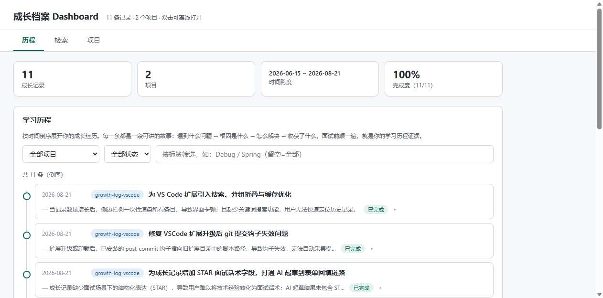
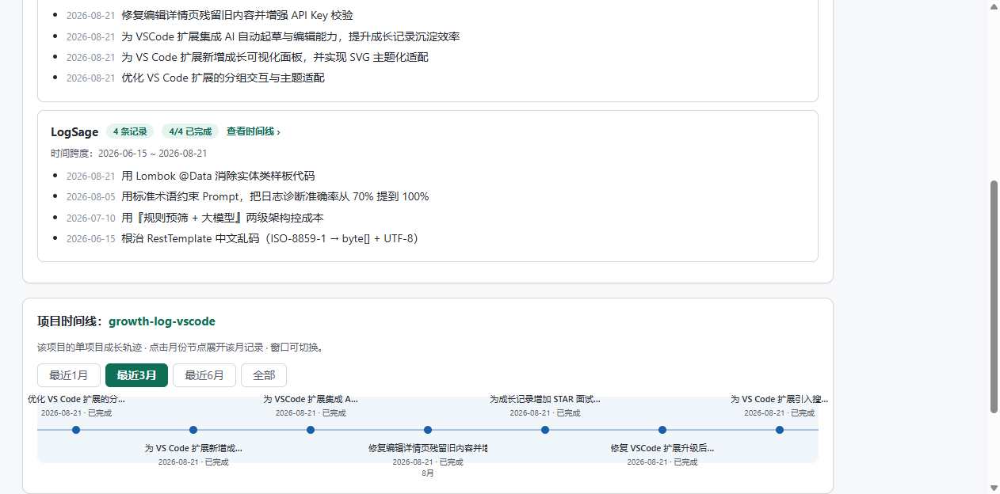

# 成长记录 Growth Log

> 把日常开发中改过的代码、踩过的坑、调优过的代码，沉淀成面试可展示的能力证据——**全功能内置，开箱即用**。

[](https://code.visualstudio.com/)
[](LICENSE)

一个 VS Code 扩展，专门解决**学习与面试之间最常被忽略的那段距离**：你每天都在改代码、踩坑、调优，但事后你几乎回想不起"那次到底解决了什么、学到了什么"。这个扩展把你日常的成长痕迹**就地沉淀**成结构化的能力证据——**STAR 话术卡、成长时间线、检索友好的项目档案**——让"我学到了什么"不再是面试前才临时拼凑的话。

## 界面预览

**Dashboard：历程时间线**（自包含 HTML，保存记录即自动生成）


**Dashboard：单项目时间线**（点击项目卡查看该项目的成长轨迹）


## 核心特性

- **就地记录**　编辑器右键 / 命令面板打开表单，预填当前选区或 `git diff`，补全"问题/根因/方案/收获/标签"即可
- **git 钩子自动抓取**　`git commit` 后自动入库，`status: pending-ai`，零点击囤原始素材
- **AI 自动起草**（可选）　配置 OpenAI 兼容 API（DeepSeek / OpenAI / 通义 / 智谱 / Kimi / 自定义），新增/抓取后自动起草"问题/方案"，你在 VS 内补"根因/收获"即可
- **STAR 面试话术卡**　自动生成，star 字段从 problem/solution/lesson 兜底推导，无需手动填
- **可检索的 Dashboard**　历程时间线 + 全文搜索 + 项目经历与单项目时间线，离线可打开
- **侧边栏即时浏览**　按时间/项目/标签折叠，搜索 + 筛选，大档案自动按月聚合不卡
- **零外部依赖**　所有渲染在扩展进程内完成，**不需要 Python，不需要任何其他工具**

## 快速上手（30 秒）

1. 在 VS Code 活动栏点 **成长记录** 图标，展开侧边栏
2. 命令面板 `Ctrl/Cmd+Shift+P` → **成长记录：新增一条**
3. 在表单中填写四段反思（已配置 AI 模型时点「✨ AI 起草」可一键填充）
4. 保存 → 侧边栏即时出现记录 → Dashboard 自动生成 STAR 卡与时间线
5. 想让提交自动入库？装好 git 钩子后，**以后每次 `git commit` 都自动入库**，有空再补反思即可

> 💡 反思的"根因"和"收获"请务必由你本人写——AI 可以起草问题/方案，但**思考深度才是面试真正的弹药**。

## 命令列表

| 命令 | 说明 |
| --- | --- |
| **成长记录：新增一条** | 读取选区 / `git diff`，弹出反思表单 |
| **成长记录：刷新** | 重读本地档案 |
| **成长记录：切换分组方式** | 侧边栏按时间 / 项目 / 标签切换 |
| **成长记录：按关键词搜索** | 全文搜索（标题 / 问题 / 方案 / 收获 / 标签） |
| **成长记录：按项目或标签筛选** | 侧边栏聚焦特定项目/标签 |
| **成长记录：查看成长档案** | 弹出记录清单 + Dashboard 打开按钮 |
| **成长记录：安装 git 钩子** | 在当前仓库写 `post-commit` 钩子（提交即自动抓取） |
| **成长记录：卸载 git 钩子** | 删除该钩子 |
| **成长记录：打开档案文件夹** | 资源管理器打开本地档案目录 |
| **成长记录：配置 AI 模型（自动起草）** | 选择厂商并填入 API Key |
| **成长记录：编辑此记录** | 打开预填表单修改并保存 |

侧边栏右键条目：**编辑此记录 / 删除此记录**。

## 自动抓取（git 钩子）流程

不想每次手动点表单？装好钩子后**每次 `git commit` 自动入库**：

1. 命令面板 → **成长记录：安装 git 钩子**（只对当前仓库生效，写 `.git/hooks/post-commit`）
2. 之后每次提交，钩子自动写入 `repo / branch / commit / 改动文件 / diff`，`status: pending-ai`
3. **已配置 AI 模型** → 扩展监听本地库，自动调用 LLM 起草整条记录并改 `status: draft`，弹窗提示"去补充根因与收获"
4. **未配置 AI 模型** → 攒几条后用命令 `起草待办` 批量起草（依赖 WorkBuddy Skill，可选）
5. 在侧边栏右键"编辑此记录"补 `根因 / 收获 / 标签`，保存后 `status: done` 即成为正式面试弹药

**噪音过滤**：跳过 merge 提交与空 diff，按 commit 去重。
**需要 Node.js**（钩子执行 capture.js），未安装时钩子会友好提示。

## 配置（VS Code 设置）

| 设置 | 说明 |
| --- | --- |
| `growthLog.provider` | AI 厂商标识：`deepseek` / `openai` / `qwen` / `zhipu` / `moonshot` / `custom` |
| `growthLog.baseUrl` | OpenAI 兼容 API 的 base URL，如 `https://api.deepseek.com/v1` |
| `growthLog.model` | 模型名，如 `deepseek-chat`、`gpt-4o-mini` |
| `growthLog.dataDir` | 档案目录（留空则用 `~/.workbuddy/growth-log`，可改） |

API Key 通过 `成长记录：配置 AI 模型` 命令填入，存于 VS Code SecretStorage，**不会**写入任何配置文件。

## 数据存储

```
<dataDir>/
├── entries.json          # 主库（单一数据源）
├── entries.md            # 镜像（人读 / 可进版本库）
├── growth_star.md        # STAR 面试话术卡
├── growth_index.md       # 按项目 / 按标签的分类索引
└── growth_dashboard.html # 自包含交互式 Dashboard
```

默认 `<dataDir> = ~/.workbuddy/growth-log`，可通过 `growthLog.dataDir` 修改为任意位置。
**全部数据存储在本地，不上传任何服务器**。删除扩展不会自动删除数据；删除文件夹即可彻底清理。

## 隐私

- **默认零 API key**：不开通 AI 模型功能时，扩展不发任何网络请求
- **AI 起草时**：只把你编辑器里的代码上下文（diff / 选区）发给你配置的 API，不发其他数据
- **所有记录存在本地 JSON 文件**：`entries.json`，请妥善保管
- **API Key** 存于 VS Code SecretStorage（系统级凭据管理），不写入项目文件

## 与 WorkBuddy 的关系

如果你使用 [WorkBuddy](https://workbuddy.cn) 桌面端，可以安装 `growth-log` Skill 享受额外的 AI 起草与导出能力（向 Skill 说"起草待办""生成 STAR""导出成长档案"等）。**非必须**——本扩展已自带所有渲染能力，可独立完整运行。

## 常见问题

**问：AI 起草用了我的 API Key 会不会很贵？**
答：默认不会调用 AI。新增/抓取时扩展只在**显式触发**「AI 起草」按钮时调用一次；commit 后自动起草也是一次调用一条记录。DeepSeek 等平价模型足够。

**问：数据会被上传吗？**
答：不会。所有数据存在本地。AI 起草时只把代码上下文发给你配置的 API endpoint（DeepSeek/OpenAI 等官方 API），不发其他东西。

**问：可以多人协作吗？**
答：主库 `entries.json` 是本地文件，可纳入 Git 仓库 / 团队 Wiki 共享。Dashboard 是单文件 HTML，团队成员各自生成即可。

**问：侧边栏的记录很多会卡吗？**
答：默认按项目分组，超过 40 条的项目自动按月二级折叠；时间窗搜索、关键词搜索都能秒级定位。

## 开发

```bash
npm install
npm run typecheck    # 类型检查
npm run build        # 构建 dist/extension.js
npm run watch        # 监听改动
```

**调试**：用 VS Code 打开本项目按 `F5`，在"扩展开发宿主"窗口里测试命令。

**打包**：`npx @vscode/vsce package` → 生成 `.vsix` → VS Code 扩展面板"从 VSIX 安装"。

## 许可

[MIT](LICENSE)
